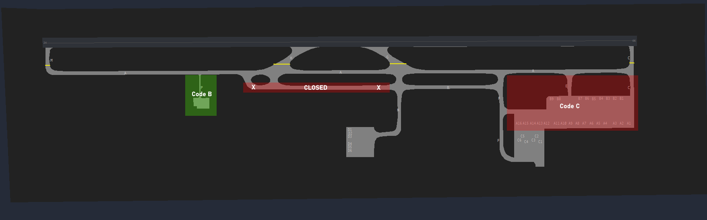

# Ground
The responsibility of SMC at King Shaka falls to the dedicated Ground ATS unit, "King Shaka Ground" (FALE_GND) on 121.650 MHz. SMC will be responsible for the aerodrome movements outside of the runway, including pushback and taxi to/from the runway. SMC will also be responsible for the initial call of VFR aircraft looking for start and taxi to the runway.

## Visual Flight Rules (VFR) Aircraft.
On initial call with SMC, the VFR aircraft is expected to provide:

* Aircraft Registration, if the callsign used is not the aircraft registration
* Aircraft Type
* Persons on Board
* Fuel Endurance
* Intentions

Once this data has been received by the SMC controller, the controller shall then issue the QNH, Active, and if operating on a FPL, a squawk.
At Durban, filing a flight plan as VFR is not mandatory unlike Cape Town, so you do not need to ask for a pilot to file a flight plan.

!!! info "VFR Phraseology"
    "ZSDUR, thank you, start up approved, expect Runway 06, QNH 1015, report ready for taxi."

## Restrictions

Whilst Durban King Shaka is able to accomodate Code F aircraft (Airbus A380-800, Boeing 747-800s or any aircraft with a wingspan between 65 and 80 metres), these aircraft are fairly restricted in where they are able to operate.

### Stand Restrictions

| Stands | Restricted To |
| :---------: | :---------: |
| A1 - A16 | Code C (max 36m wingspan) |
| B1 - B9 | Code C (max 36m wingspan) |
| C1, C3, C4, and C6 | Code C (max 36m wingspan) in MARS configuration. |
| C2 and C5 | Code F (max 80m wingspan) |
| D1, D3, D4, and D6 | Code C (max 36m wingspan) in MARS configuration. |
| D2 and D5 | Code F (max 80m wingspan) | 

**MARS**

MARS — Multiple Aircraft Ramp System — is an airport gate design that allows a single aircraft parking stand to accommodate more than one type or size of aircraft.

At Durban, the following stands can be used in conjuction with each other, up to a maximum of Code C (max 36m wingspan) aircraft on them.

| Stands | Blocks off Stand |
| :---------: | :---------: |
| C1 and C3 | C2 |
| C4 and C6 | C5 |
| D1 and D3 | D2 |
| D4 and D6 | D5 |

### Taxiway and Apron Restrictions

!!! warning 
    The Airbus A380s should not be taxiied onto either the Alpha, Bravo or Echo Aprons at any time, as these are not suitable for them. They may only enter Aprons Charlie and Delta.

| Aprons | Restricted to |
| :---------: | :---------: |
| Alpha Apron | Code C (max 36m wingspan)
| Bravo Apron | Code C (max 36m wingspan)
| Echo Apron | Code B (max 24m wingspan)

## Pushback Procedures

!!! note "Notes"
    Aircraft pushing off Stand C2 will require to be pushed and then pulled back onto the Apron in order to line up with the centreline due to a lack of space with the terminal.

    Some stands, such as those on the Charlie and Delta Aprons do not require a direction to be given, as there is only one real way to get out the apron.

    Aircraft pushing off Stand A1 should be instructed to face West (06) or North (24), but never to the East, as there is insufficient room for them to do so.

**An aircraft must be squawking their assigned ASSR code provided in the clearance before pushback clearance is issued. If this is not the case, the SMC controller must instruct the pilot to do so BEFORE any push clearance is issued.**

!!! info "Pushback Phraseology"
    "(callsign), push and start approved, QNH (QNH)."

## Taxi Procedures

By default, all aircraft should be taxiied to the full length holding point unless otherwise requested by a pilot.

During Runway 06 operations, only C and G may be used as departure points, and during Runway 24, only H and M may be used as departure points.

!!! info "Taxi Phraseology"
    "(callsign), taxi to holding point C Runway 06 via F and A."

### Runway 24 Hotspots

!!! warning
    During Runway 24 operations, there is an increased chance of conflict with vacating aircraft at G, and taxiing aircraft to the holding point Runway 24.
    In this case, it may be recommended for aircraft outbound to taxi via B to hold short of N in busy situations. 

### Arriving Aircraft
Upon arrival into King Shaka, inbound aircraft are to provide their aircraft registration (tail number) and their parking bay (stand number) that they desire. You must check that their requested stand is in compliance with the restrictions listed above. If so, then the aircraft can be instructed to taxi to the bay. If not, ask the pilot for a different stand, or feel free to assign one yourself.

!!! info "Pilot Reporting Bay Number"
    SAA233: "SAA233, we are ZS-SZF looking for Bay A4."

!!! info "Taxiing to the Bay"
    FALE_GND: "SAA233, thank you, taxi via A and F to the bay."

## Other Rules

No intersection take-offs between 2000 to 0400 LT.