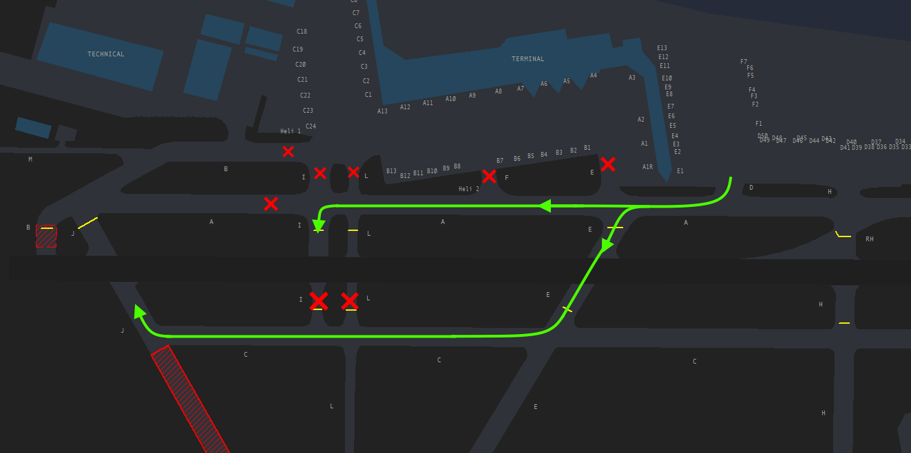

# Ground
The responsibility of SMC at O.R. Tambo falls to the dedicated Ground ATS unit, "O.R. Tambo Ground" (FAOR_GND) on 121.900 MHz. SMC will be responsible for the aerodrome movements outside of the runway, including pushback and taxi to/from the runway. SMC will also be responsible for the initial call of VFR aircraft looking for start and taxi to the runway.

## Visual Flight Rules (VFR) Aircraft.
On initial call with SMC, the VFR aircraft is expected to provide:

* Aircraft Registration, if the callsign used is not the aircraft registration
* Aircraft Type
* Persons on Board
* Fuel Endurance
* Intentions

Once this data has been received by the SMC controller, the controller shall then issue the QNH, Active, and if operating on a FPL, a squawk.
At Johannesburg, filing a flight plan as VFR is not mandatory unlike Cape Town, so you do not need to ask for a pilot to file a flight plan.

!!! info "VFR Phraseology"
    "ZSDUR, thank you, start up approved, expect Runway 03L, QNH 1015, report ready for taxi."

## Restrictions

Whilst Johannesburg is able to accomodate Code F aircraft (Airbus A380-800, Boeing 747-800s or any aircraft with a wingspan between 65 and 80 metres), these aircraft are fairly restricted in where they are able to operate.

The black hatched lines in this image indicate where an A380 is not permitted to taxi.

### Approved Code F Stands

* E3, E6, E9, E12
* F3, F6
* D1, D3A, D4A, D50

**MARS**

MARS — Multiple Aircraft Ramp System — is an airport gate design that allows a single aircraft parking stand to accommodate more than one type or size of aircraft.

At Johannesburg , the following stands can be used in conjuction with each other, up to a maximum of Code C (max 36m wingspan) aircraft on them.

| Stands | Blocks off Stand |
| :---------: | :---------: |
| B2 and B4 | B3 |
| B5 and B7 | B6 |
| D2L and D2R  | D2 |
| D3L and D3R  | D3 |
| D4L and D4R  | D4 |
| D5 and D7  | D6 |
| D8 and D10  | D9 |
| D11 and D13  | D12 |
| D14 and D15  | D66 |
| D16 and D18  | D17 |
| D19 and D20  | D77 |
| D21 and D23 | D22 |
| D24 and D26 | D25 |
| D27 and D29 | D28 |
| D30 and D32 | D31 |
| D33 and D35 | D34 |
| D36 and D38 | D37 |
| D39 and D41 | D40 |

### Taxiway Restrictions

!!! note "Notes"

    Taxiway C between Taxiway N and Threshold 21R available for up to Code C aircraft.
    
    Taxiway M has a max wingspan of 36m / 118ft.
    
    Taxiline abeam stands D2-D50 available only up to a max wingspan of a Boeing 747-400 (64m).
    
    No aircraft with a wingspan of 52M or greater (Code E and F) are permitted on the taxiline abeam D2-D50 when aircraft with a wingspan of 65m or greater (Code F) are taxiing on Taxiway A abeam the D Apron.

    Code F aircraft entering Bay D1 are to do so via Taxiway G8.
    
    Code F aircraft entering Bay D3A to enter via Taxiway G9.

## Pushback Procedures

!!! note "Notes"
    Aircraft pushing back from Bays D2, D3 and D4 must be pushed back to face north and exit onto Taxiway G8.

    Aircraft pushing back from Bay D3A must be pushed back to face north to exit onto Taxiway G9.

    When Code F aircraft pushback from Bay D50 onto Taxiway D, the aircraft will be enroaching on Taxiway A. Aircraft on Taxiway A to hold short of Taxiway D when Code F aircraft are pushing back from or to enter D50.
    
    Parking Stands G1, G3, G5 and G7 are multi-configured for aircraft power out and push back. Taxi out can only be completed by aircraft which have a wingspan of 23m or less, and an aircraft length of 32.5m or less.

    Code F aircraft from D1 to exit via Taxiway G8. Pushback to face north and pull forward until wingtip aligned with stand D2R, then exit via G8.
    
    Code F aircraft from E12 to be pushed tail first into F6, before being aligned on the taxiway centreline.

**An aircraft must be squawking their assigned ASSR code provided in the clearance before pushback clearance is issued. If this is not the case, the SMC controller must instruct the pilot to do so BEFORE any push clearance is issued.**

!!! info "Pushback Phraseology"
    "(callsign), push and start approved, face (direction), QNH (QNH)."

## Taxi Procedures

!!! warning
    Intersection B between the CAT 1 Holding Point and the threshold is closed. All departures will need to be routed out via Intersection J (West and East) for 03L.
     
To help expedite the flow of traffic out of Johannesburg during busy operations, the SMC controller may ask the pilot if they are able for an intersection. For 03L, this will typically be I or L, for 21R this will typically be N. This should first be coordinated with TWR to avoid conflict.

For Runway 03L, the SMC controller should only taxi aircraft as far as the CAT 2/3 Holding Points, before being handed off to TWR. The TWR West controller will be primary responsible for sequencing for departures. 

!!! warning "CAT 2 Hold 03L"
    The SMC controller should not send any aircraft to holding point J (west) without the prior approval of the TWR controller.

!!! info "Taxi Phraseology (CAT 2 Hold)"
    "(callsign), taxi to the CAT 2 holding point Runway 03L via D and A.".

**The pilot is to read back the CAT 2 Holding Point, if they do not, you must pick up and make sure they do.**

!!! info "Taxi Phraseology Regular"
    "(callsign), taxi to holding point Q, via D and A.".

Aircraft should be handed off early before reaching the desired holding point.

### Code F Taxi Diagram (03L)

!!! info
    The SMC controller shall inform the Tower West controller once a Code F aircraft has begun pushing and started its taxi for a planned crossing of 03L. This allows sufficient deconfliction with any crossing traffic which may block the path of the aircraft later on. Under no circumstances should an SMC controller cross an aircraft across the runway.

### Arriving Aircraft
Upon arrival into O.R. Tambo, inbound aircraft are to provide their aircraft registration (tail number) and their parking bay (stand number) that they desire. This will initially be passed to Tower East if vacating on 03R, which will be relayed to the SMC controller. You must check that their requested stand is in compliance with the restrictions listed above. If so, then the aircraft can be instructed to taxi to the bay. If not, ask the pilot for a different stand, or feel free to assign one yourself.

!!! info "Pilot Reporting Bay Number"
    SAA233: "SAA233, we are ZS-SZF looking for Bay C1."

!!! info "Taxiing to the Bay"
    FAOR_TWR: "SAA233, thank you, taxi via E, K and L, hold 03L."

    FAOR_GND: "SAA233, welcome, taxi via L to the bay, bye bye."