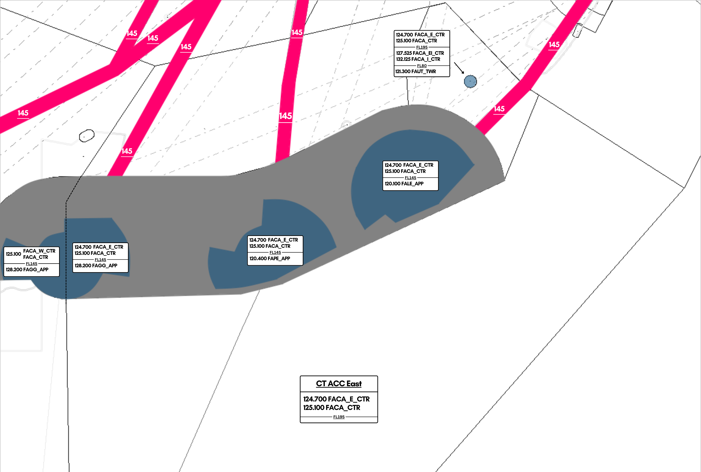

# 3. Cape Town Area (East)

## Inbound / Arrival Clearances

On contact with the first FACA unit (FACA_W) or (FACA_E), the controller will be the one to issue the arrival clearance into Cape Town. Controllers are to check the latest NOTAMs, aswell as the Cape Town TMA page to keep up to date with the latest STARs in use.

!!! note 
    These STARs are also applicable for aircraft flying into Ysterplaat (FAYP)

When giving the arrival clearance, the aircraft should first be cleared inbound into the sector at their current level, before being passed a STAR, landing runway, and ATIS code in range.

!!! info "STAR Clearance Phraseology"
    "(callsign), cleared inbound FL(flight level), (STAR) arrival landing (runway), check ATIS (code) in range."

e.g.

SAA369, cleared inbound FL340, ERDAS1C arrival landing Runway 01, check ATIS B in range.

Should the aircraft either:
* Already have received its STAR clearance for FACT/FAYP from another ATS unit
* Overflying FACA or your sector in general
* Flying to FAGG, FAPE, FAEL where the aircraft route terminates at the destination VOR.

then the controller should only clear the aircraft at their level.

!!! info "Inbound Phraseology"
    "(callsign), cleared inbound FL(flight level)."

e.g.

SAA369, cleared inbound FL340.

The pilot should read back their cleared level as confirmation.

## Handoff Agreement

The agreed level for handoff from ACC to a civil APP unit is FL160.
The agreed level for handoff from ACC to a military APP unit is FL200.

!!! note
    At first, when a pilot requests descent, they should only be cleared to descend as low as the lower limit of the FIR/UIR (FL195), but in our case, FL200.

    Only once the controller is satisfied that the pilot will not leave controlled airspace whilst descending, should the aircraft then be given further descent to FL160 and a handoff.

## Mthatha (FAUT) Arrival Procedure

Mthatha Airport (IATA: UTT, ICAO: FAUT) is an airport serving Mthatha (formerly Umtata), a city in the Eastern Cape province of South Africa.

Mthatha is a towered aerodrome, but has no controlled airspace around it. As a result, pilots flying into FAUT will need to navigate uncontrolled airspace before contacting approach at an RNAV IAF fix to commence the approach.

In this instance, aircraft are to be descended to the lowest suitable level of the FIR, at FL200. Once reaching FL200, the aircraft should have its radar services terminated, before being advised to broadcast on 122.8, or the relevant FIS frequency if one is online.

!!! info "Phraseology"
    "(callsign), radar control terminated, broadcast 122.8."

Should you be the unit to control Mthatha top down, the aircraft should then call you back established on final approach for the designed runway in use.

## Use of Radar Separation

* Separation assurance using ATS surveillance as a primary aid in the area control environment is implemented within the FAJA and FACA FIR above FL195 (19500FT). 
* All transponder equipped aircraft operating in all routes within South Africa above FL195 (19500FT) are tracked by at least 2 different ATS surveillance sensors.
* Consequently the following ATM elements need to be considered. ATS Surveillance Control Service will be automatically transferred from Approach or from adjacent Area Control Sectors, which will mean that the frequency change will not include a termination of ATS Surveillance control Service. 
* Pilots are to take note that the En-route separation of 10 minutes at same level may be reduced to 10NM, demanding appropriate vigilance, R/T discipline and accuracy.

## Enroute CPDLC / SELCAL

The Cape Town Flight Information Region (FACA) is equipped and is able to operate enroute CPDLC coverage for aircraft operating above FL195, which is built into the sector files through TopSky, and requires an active Hoppie's Code to use.

The following instructions can be transmitted via CPDLC.

* Altitude Change (Climb/Descent)
* Heading Instructions
* Direct To (Fix)

As well as this, TopSky offers the following free text options to be transmitted for FACA-W.

* SERVICE TERMINATED. MONITOR UNICOM 122.800
* SERVICE TERMINATED. SQUAWK 2000. MONITOR UNICOM 122.800
* CERTAIN INSTRUCTIONS UNAVAILABLE VIA DATALINK. PLEASE MONITOR * VOICE AT ALL TIMES
* CPDLC SERVICE TERMINATED. REVERT TO VOICE
* CPDLC SERVICE TERMINATE PASSING FL195. REVERT TO VOICE.
* RADAR SERVICE TERMINATED.
* ALL ATS TERMINATED.
* RADAR CONTACT LOST.
* NO DELAY EXPECTED.
* DELAY NOT DETERMINED.
* REPORT APPROACHING TOP OF DESCENT ON VOICE.
* REPORT APPROACHING TOP OF DESCENT.
* CHECK STUCK MICROPHONE
* CONTINUE PRESENT HEADING
* RESUME NORMAL SPEED
* REPORT YOUR MACH NUMBER.
* REPORT YOUR IAS.
* REQUEST NOT SUPPORTED VIA DATALINK. REVERT TO VOICE.

There is no SELCAL capabilities within the Cape Town FIR.

!!! info
    All arrival clearances are to be transmitted through voice on initial contact. CPDLC may not be used for this function to issue arrival clearances.

