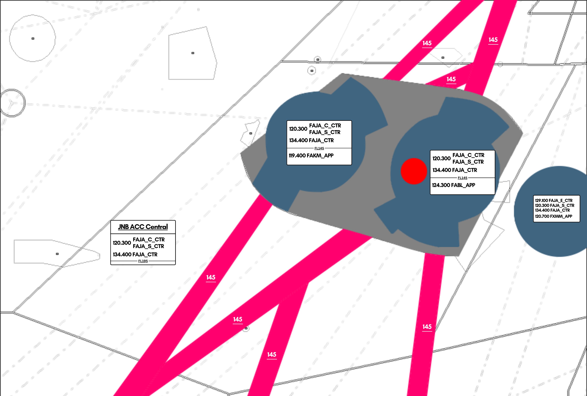

# 5. Johannesburg Area (Central)

## Inbound / Arrival Clearances

Arrival clearances for FAJA airports are issued by the first FAJA ATS unit that the plane will have contact with.

For flights flying to O.R. Tambo Intl (FAOR), either transferred from a FACA unit, or climbing out of Kimberley/Blomfontein will need to have their clearance issued by you.

For aircraft which are also flying to Durban, and you are the first FAJA ATS unit to have contact with the aircraft, you will also need to issue the relevant arrival clearance for Durban

For aircraft passing through the FAJA_C sector, most FAOR arrivals will converge at NIBEX.

When giving the arrival clearance, the aircraft should first be cleared inbound into the sector at their current level, before being passed a STAR, landing runway, and ATIS code in range.

!!! warning
    When issuing the landing runway, only the direction shall be given. i.e. 03 or 21, and not 03L or 21R. Johannesburg Radar (FAOR_APP) is the primary ATS unit to give this on initial check in. Should a pilot ask, tell them to expect the landing runway later.

!!! info "STAR Clearance Phraseology"
    "(callsign), cleared inbound FL(flight level), (STAR) arrival landing (runway), check ATIS (code) in range."

e.g.

SAA369, cleared inbound FL350, NIBEX1B arrival, landing 03, check ATIS Y in range.  

Should the aircraft only be overflying the ATS sector (i.e. flying from FAJA_SW into FACA or otherwise), then the controller should only clear the aircraft at their level.

!!! info "Inbound Phraseology"
    "(callsign), cleared inbound FL(flight level)."

e.g.

SAA369, cleared inbound FL340.

The pilot should read back their cleared level as confirmation.

## Handoff Agreement

The agreed level for handoff from ACC to a civil APP unit is FL160.
The agreed level for handoff from ACC to a military APP unit is FL200.

!!! note
    At first, when a pilot requests descent, they should only be cleared to descend as low as the lower limit of the FIR/UIR (FL195), but in our case, FL200.

    Only once the controller is satisfied that the pilot will not leave controlled airspace whilst descending, should the aircraft then be given further descent to FL160 and a handoff.

## Letters of Agreement

Aircraft flying into the Johannesburg TMA should be handed off to the next ATS unit with at least 20 miles in trail of each other. In case this can not be satisfied, the controller must coordinate with the relevant ATS unit.

### Maseru

All aircraft flying into and out of FXMM are subject to 10 minute separation on all inbound and outbound flights heading in the same direction.

Aircraft may be handed directly to FXMM_APP rather than passing through FAJA_E_CTR. Handoffs at FL200.

## Use of Radar Separation

* Separation assurance using ATS surveillance as a primary aid in the area control environment is implemented within the FAJA and FACA FIR above FL195 (19500FT). 
* All transponder equipped aircraft operating in all routes within South Africa above FL195 (19500FT) are tracked by at least 2 different ATS surveillance sensors.
* Consequently the following ATM elements need to be considered. ATS Surveillance Control Service will be automatically transferred from Approach or from adjacent Area Control Sectors, which will mean that the frequency change will not include a termination of ATS Surveillance control Service. 
* Pilots are to take note that the En-route separation of 10 minutes at same level may be reduced to 10NM, demanding appropriate vigilance, R/T discipline and accuracy.

## Enroute CPDLC / SELCAL

The Johannesburg Flight Information Region (FAJA) is equipped and is able to operate enroute CPDLC coverage for aircraft operating above FL195, which is built into the sector files through TopSky, and requires an active Hoppie's Code to use.

The following instructions can be transmitted via CPDLC.

* Altitude Change (Climb/Descent)
* Heading Instructions
* Direct To (Fix)

As well as this, TopSky offers the following free text options to be transmitted for FACA-W.

* SERVICE TERMINATED. MONITOR UNICOM 122.800
* SERVICE TERMINATED. SQUAWK 2000. MONITOR UNICOM 122.800
* CERTAIN INSTRUCTIONS UNAVAILABLE VIA DATALINK. PLEASE MONITOR * VOICE AT ALL TIMES
* CPDLC SERVICE TERMINATED. REVERT TO VOICE
* CPDLC SERVICE TERMINATE PASSING FL195. REVERT TO VOICE.
* RADAR SERVICE TERMINATED.
* ALL ATS TERMINATED.
* RADAR CONTACT LOST.
* NO DELAY EXPECTED.
* DELAY NOT DETERMINED.
* REPORT APPROACHING TOP OF DESCENT ON VOICE.
* REPORT APPROACHING TOP OF DESCENT.
* CHECK STUCK MICROPHONE
* CONTINUE PRESENT HEADING
* RESUME NORMAL SPEED
* REPORT YOUR MACH NUMBER.
* REPORT YOUR IAS.
* REQUEST NOT SUPPORTED VIA DATALINK. REVERT TO VOICE.

There is no SELCAL capabilities within the Cape Town FIR.

!!! info
    All arrival clearances are to be transmitted through voice on initial contact. CPDLC may not be used for this function to issue arrival clearances.

