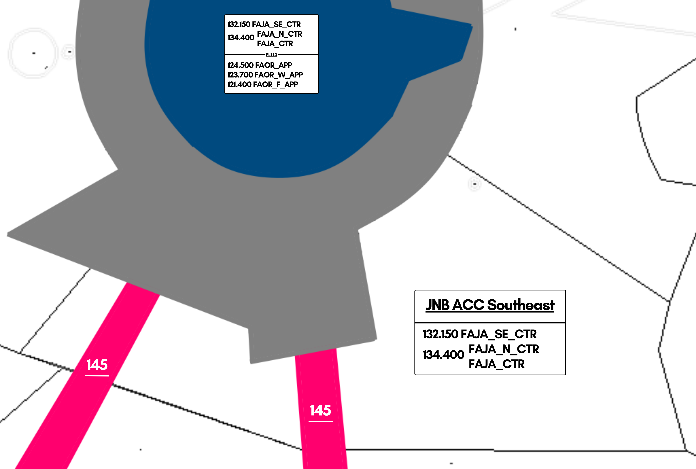
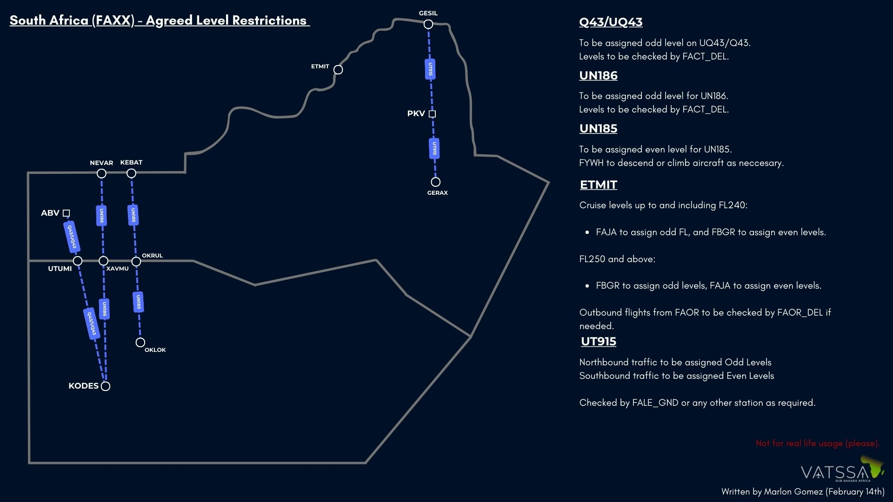
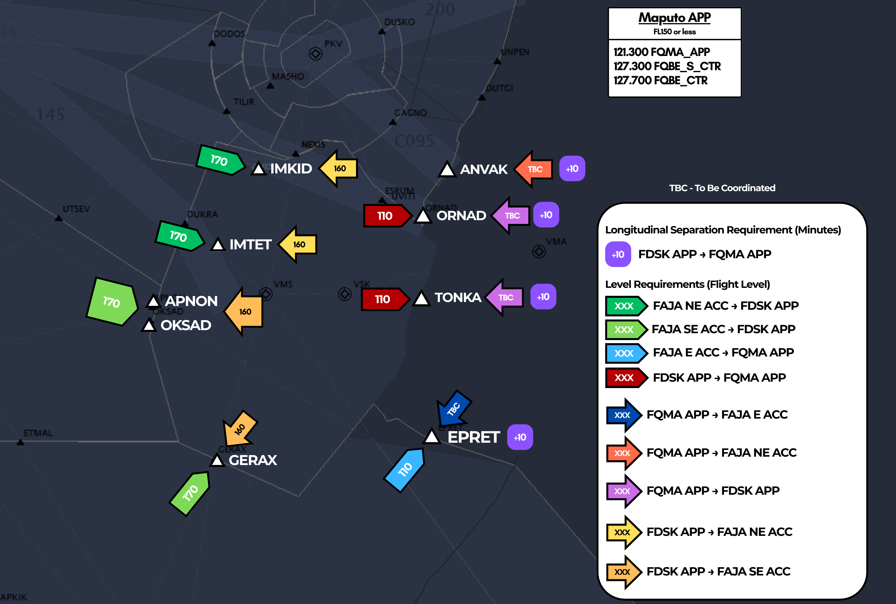

# 7. Johannesburg Area (South-East)

## Inbound / Arrival Clearances

Arrival clearances for FAJA airports are issued by the first FAJA ATS unit that the plane will have contact with.

In the FAJA-SE sector, aircraft flying to Durban will have the inbound clearance issued by FAJA-SE.

As of 25/08/2025, the STV arrivals are no longer in effect for FAOR. However, as STV still remains a waypoint on the UZ29 airway, aircraft will instead need to be taken off the airway to be routed to "UNPOM" to join the arrival.

In some cases, most commonly during Runway 21 operations at FAOR, aircraft terminating at AVILO may be routed thereafter to UNPOM to join the arrival from UNPOM instead.

When giving the arrival clearance, the aircraft should first be cleared inbound into the sector at their current level, before being passed a STAR, landing runway, and ATIS code in range.

!!! warning
    When issuing the landing runway, only the direction shall be given. i.e. 03 or 21, and not 03L or 21R. Johannesburg Radar (FAOR_APP) is the primary ATS unit to give this on initial check in. Should a pilot ask, tell them to expect the landing runway later.

!!! info "STAR Clearance Phraseology"
    "(callsign), cleared inbound FL(flight level), (STAR) arrival landing (runway), check ATIS (code) in range."

!!! info "STAR Clearance Phraseology (UNPOM)"
    "(callsign), cleared inbound FL(flight level), after EPSAK, direct UNPOM, cleared UNPOM1A arrival landing 03, check ATIS (code) in range."

e.g.

SAA369, cleared inbound FL340, after AVILO, direct UNPOM, cleared UNPOM1B arrival landing 21, check ATIS E in range.

Should the aircraft only be overflying the ATS sector, then the controller should only clear the aircraft at their level.

!!! info "Inbound Phraseology"
    "(callsign), cleared inbound FL(flight level)."

e.g.

SAA369, cleared inbound FL340.

The pilot should read back their cleared level as confirmation.

!!! warning
    You will not be issuing arrival clearances for FAOR if an aircraft transfers over from another FAJA unit, i.e. a flight flying from FALE -> FAOR will have its arrival clearance issued by the sector covering the FAJA_E sector. As a result, you will only be clearing them inbound into the FAJA_SE sector at their level.

    Should there not be a sector online covering FAJA_E, in this case you will then need to issue the arrival clearance for FALE as you will be the first FAJA unit to do so.

i.e.

SAA369, cleared inbound FL350, UNPOM1B arrival, landing 21, check ATIS E in range.

## Handoff Agreement

The agreed level for handoff from ACC to a civil APP unit is FL160.
The agreed level for handoff from ACC to a military APP unit is FL200.

!!! note
    At first, when a pilot requests descent, they should only be cleared to descend as low as the lower limit of the FIR/UIR (FL195), but in our case, FL200.

    Only once the controller is satisfied that the pilot will not leave controlled airspace whilst descending, should the aircraft then be given further descent to FL160 and a handoff.

## Letters of Agreement

**FAJA and FVHF agree that aircraft flying on UT915 are to be assigned levels as such:**

Northbound: Odd Levels
Southbound: Even Levels

!!! warning
    FAJA_E to ensure traffic flying northbound are complying with odd levels. Aircraft which require an even level will require prior coordination with the relevant ATS unit.

### Maputo

The Letter of Procedure between the FAJA ACC and FQBE ACCs is as follows:

**FAJA ACC E -> FQMA APP**: 10 Minutes
**FAJA ACC E -> FQBE ACC**: 10 Minutes

Aircraft flying into FQMA should be routed into either ORNAD, TONKA or EPRET.

Aircraft routing via ORNAD or TONKA will initially be handed to FDSK_APP before handoff to the relevant Maputo APP frequency.

!!! note
    The levels depicted are depicted "level at a waypoint". Early handoffs should be the priority to ensure a smooth transition between the relevant ATS units.

    "SAA304, descend FL170 to be level at IMKID."

!!! tip
    Should two aircraft be on track for the same entry waypoint into FQMA (either ORNAD, TONKA or EPRET), then guaranteed that the 10 minute separation will not be a factor, the other aircraft may be routed to a different entry point in accordance to avoid a 10 minute delay.

Aircraft not flying into FQMA, but are transitting via the FQBE FIR should ensure 10 minute separation between aircraft at the same level. Aircraft typically flying into FQBE will be handed off at eastbound levels.

### Matsapha TMA

ALl aircraft flying in and out of the Matspha TMA are subject to 10 minute separation on all inbound and outbound flights heading in the same direction.

## Use of Radar Separation

* Separation assurance using ATS surveillance as a primary aid in the area control environment is implemented within the FAJA and FACA FIR above FL195 (19500FT). 
* All transponder equipped aircraft operating in all routes within South Africa above FL195 (19500FT) are tracked by at least 2 different ATS surveillance sensors.
* Consequently the following ATM elements need to be considered. ATS Surveillance Control Service will be automatically transferred from Approach or from adjacent Area Control Sectors, which will mean that the frequency change will not include a termination of ATS Surveillance control Service. 
* Pilots are to take note that the En-route separation of 10 minutes at same level may be reduced to 10NM, demanding appropriate vigilance, R/T discipline and accuracy.

## Enroute CPDLC / SELCAL

The Johannesburg Flight Information Region (FAJA) is equipped and is able to operate enroute CPDLC coverage for aircraft operating above FL195, which is built into the sector files through TopSky, and requires an active Hoppie's Code to use.

The following instructions can be transmitted via CPDLC.

* Altitude Change (Climb/Descent)
* Heading Instructions
* Direct To (Fix)

As well as this, TopSky offers the following free text options to be transmitted for FACA-W.

* SERVICE TERMINATED. MONITOR UNICOM 122.800
* SERVICE TERMINATED. SQUAWK 2000. MONITOR UNICOM 122.800
* CERTAIN INSTRUCTIONS UNAVAILABLE VIA DATALINK. PLEASE MONITOR * VOICE AT ALL TIMES
* CPDLC SERVICE TERMINATED. REVERT TO VOICE
* CPDLC SERVICE TERMINATE PASSING FL195. REVERT TO VOICE.
* RADAR SERVICE TERMINATED.
* ALL ATS TERMINATED.
* RADAR CONTACT LOST.
* NO DELAY EXPECTED.
* DELAY NOT DETERMINED.
* REPORT APPROACHING TOP OF DESCENT ON VOICE.
* REPORT APPROACHING TOP OF DESCENT.
* CHECK STUCK MICROPHONE
* CONTINUE PRESENT HEADING
* RESUME NORMAL SPEED
* REPORT YOUR MACH NUMBER.
* REPORT YOUR IAS.
* REQUEST NOT SUPPORTED VIA DATALINK. REVERT TO VOICE.

There is no SELCAL capabilities within the Cape Town FIR.

!!! info
    All arrival clearances are to be transmitted through voice on initial contact. CPDLC may not be used for this function to issue arrival clearances.

