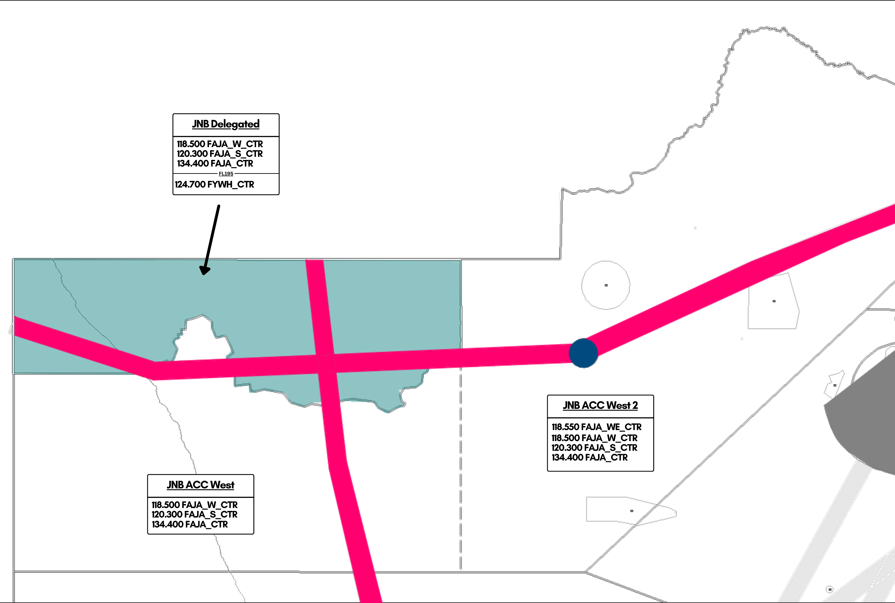

# 6. Johannesburg Area (West)

## Inbound / Arrival Clearances

Typically, through the West sector, not many flights terminating in FAJA will fly over. Only usually, will flights from South America flying to Johannesburg transit over, these aircraft you'll issue the inbound clearance into FAOR for.

When giving the arrival clearance, the aircraft should first be cleared inbound into the sector at their current level, before being passed a STAR, landing runway, and ATIS code in range.

!!! warning
    When issuing the landing runway, only the direction shall be given. i.e. 03 or 21, and not 03L or 21R. Johannesburg Radar (FAOR_APP) is the primary ATS unit to give this on initial check in. Should a pilot ask, tell them to expect the landing runway later.

!!! info "STAR Clearance Phraseology"
    "(callsign), cleared inbound FL(flight level), (STAR) arrival landing (runway), check ATIS (code) in range."

e.g.

SAA369, cleared inbound FL350, NIBEX1B arrival, landing 03, check ATIS Y in range.  

Should the aircraft only be overflying the ATS sector (i.e. simply overflying etc), then the controller should only clear the aircraft at their level.

!!! info "Inbound Phraseology"
    "(callsign), cleared inbound FL(flight level)."

e.g.

SAA369, cleared inbound FL340.

The pilot should read back their cleared level as confirmation.

## Letters of Agreement

**FYWF, FAJA and FACA agree that:**

* UN186 - Odd Levels
* UN185 - Even Levels
* UQ43/Q43 - Odd Levels

Handoffs to FAJA_W, FAJA_WE or FAJO: **10 Minutes Longitudinal Separation Required**

!!! warning
    FACA_W should ensure that aircraft travelling northbound into FAJA-W are on odd levels before handoff. Aircraft entering on even levels require prior coordination.

### Upington

## Use of Radar Separation

* In the FAJA_W sectors, no radar control service can be provided, as these sectors run as procedural ATS units.
The minimum lateral separation required between aircraft is 10 minutes, with vertical separation at 1000ft.

Whilst some radar coverage exists mainly in the FAJA_WE sector, this should not be used to provide separation or traffic information between aircraft, and is solely for the situational awareness of the controller.

West of Upington, limited radar coverage is available, in this case, the controller is to ensure full compliance of separation standards and apply any means neccesary to separate aircraft, including ensuring aircraft stick to their agreed levels as documented in the LOA between FYWF, FAJA and FACA to reduce the likelihood of a conflict with aircraft travelling west to ABV.

## Enroute CPDLC / SELCAL

The Johannesburg Flight Information Region (FAJA) is equipped and is able to operate enroute CPDLC coverage for aircraft operating above FL195, which is built into the sector files through TopSky, and requires an active Hoppie's Code to use.

The following instructions can be transmitted via CPDLC.

* Altitude Change (Climb/Descent)
* Heading Instructions
* Direct To (Fix)

As well as this, TopSky offers the following free text options to be transmitted for FACA-W.

* SERVICE TERMINATED. MONITOR UNICOM 122.800
* SERVICE TERMINATED. SQUAWK 2000. MONITOR UNICOM 122.800
* CERTAIN INSTRUCTIONS UNAVAILABLE VIA DATALINK. PLEASE MONITOR * VOICE AT ALL TIMES
* CPDLC SERVICE TERMINATED. REVERT TO VOICE
* CPDLC SERVICE TERMINATE PASSING FL195. REVERT TO VOICE.
* RADAR SERVICE TERMINATED.
* ALL ATS TERMINATED.
* RADAR CONTACT LOST.
* NO DELAY EXPECTED.
* DELAY NOT DETERMINED.
* REPORT APPROACHING TOP OF DESCENT ON VOICE.
* REPORT APPROACHING TOP OF DESCENT.
* CHECK STUCK MICROPHONE
* CONTINUE PRESENT HEADING
* RESUME NORMAL SPEED
* REPORT YOUR MACH NUMBER.
* REPORT YOUR IAS.
* REQUEST NOT SUPPORTED VIA DATALINK. REVERT TO VOICE.

There is no SELCAL capabilities within the Johannesburg FIR.

!!! info
    All arrival clearances are to be transmitted through voice on initial contact. CPDLC may not be used for this function to issue arrival clearances.

