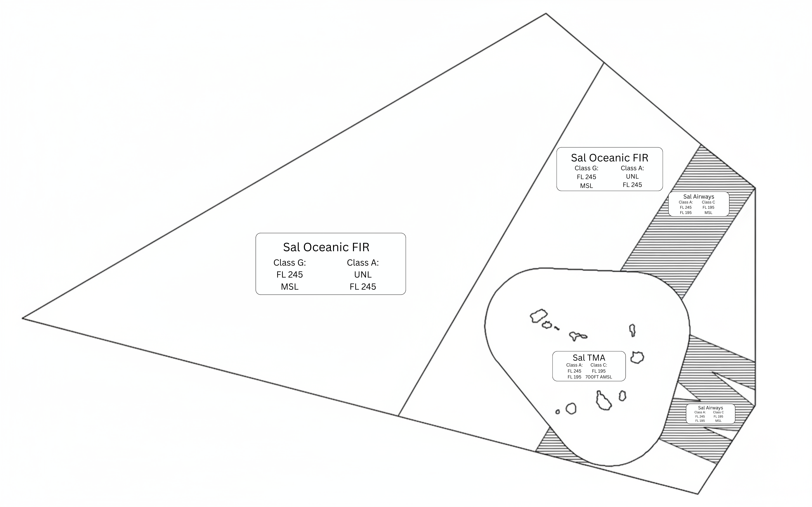
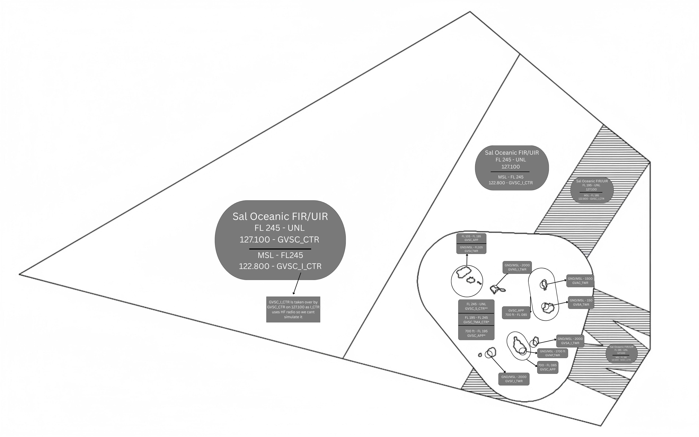

# 1. Overview
Sal Control/Oceanic have 3 main sectors of airspace
* Sal Oceanic
* Sal Control (TMA)
* Sal Oceanic (Airways) [^1]

Each individual sector is shown bellow and should be followed acordingly.

## ATS Frequencies

**Bandbox Frequencies**

| Position    | Callsign              | Frequency | Covering             |
| :---------: | :---------: | :---------: | :---------: |
| GVSC_CTR | Sal Control | 127.100 | GVSC North, South and Radio Sectors combined |

**Combined Splits** [^1]

| Position    | Callsign              | Frequency | Covering             |
| :---------: | :---------: | :---------: | :---------: |
| GVSC_N_CTR    | Sal Control     | 128.300   | GVSC_N |
| GVSC_S_CTR    | Sal Control     | 127.100   | GVSC_S |
| GVSC_APP    | Sal Control     | 126.400   | GVSC_TMA/APP |
| GVSC_I_CTR    | Sal Radio     | *******  | GVSC_I (Uncontrolled Airspace) |

!!! Note "GVSC_I_CTR"
    All Class G Airspace surrounding the Sal TMA are controlled by "Sal radio" this controller operates on HF frequencies, due to this we can simulate it however, very badly, for this reason "Sal radio" will be bandboxed with "GVSC_CTR", if a specific controller connects with the callsign "GVSC_I_CTR" it is their responsibility to find a frequency that doesnt conflict with any other surrounding controller. 

    !!! Warning "Trackaudio users"
        To simulate HF frequencies the controller must have "Audio for Vatsim" as by default Track Audio does not simulate HF Frequencies

A map of all frequencies within the Sal FIR/UIR are as follows:

!!! Warning "GVSV_TWR Operations"
    When "GVSV_TWR" is online they assume the APP Responsibilities within the CTR up to FL 105, within this airspace it is Class C and their callsign is "Soa Vicente Tower" and **NOT** "Sal Approach" even while working approach traffic [^1].

[^1]:
    All information is found within publicly available resources, the information provided in this document should not be used outside of the "VATSIM" network, all the information in this document was found within the Sal AIP found [here.](https://eaip.asa.cv/2024-04-18-AIRAC/pdf/GV-aip-en-GB.pdf)