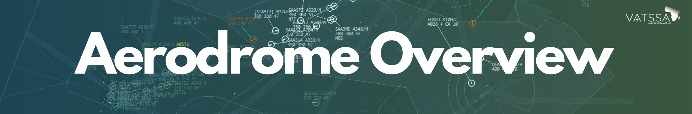

# Overview

## Purpose
The following documentation provided is outline for Enroute Operations, split by Country. This section covers only the relevant Enroute Data, including phraseology, letter of agreements and procedures for the relevant sector.

The procedures outlined in this documentation should take priority should discrepancies arise regarding the outliining of procedures.

## Exclusion of Liability

!!! warning
    All documentation in this section is intended solely for use on the VATSIM network and must not be used for real-world aviation operations. The authors disclaim any liability for personal injury or death resulting from misuse of this material.
